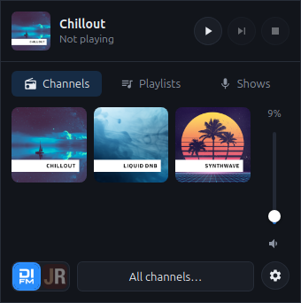
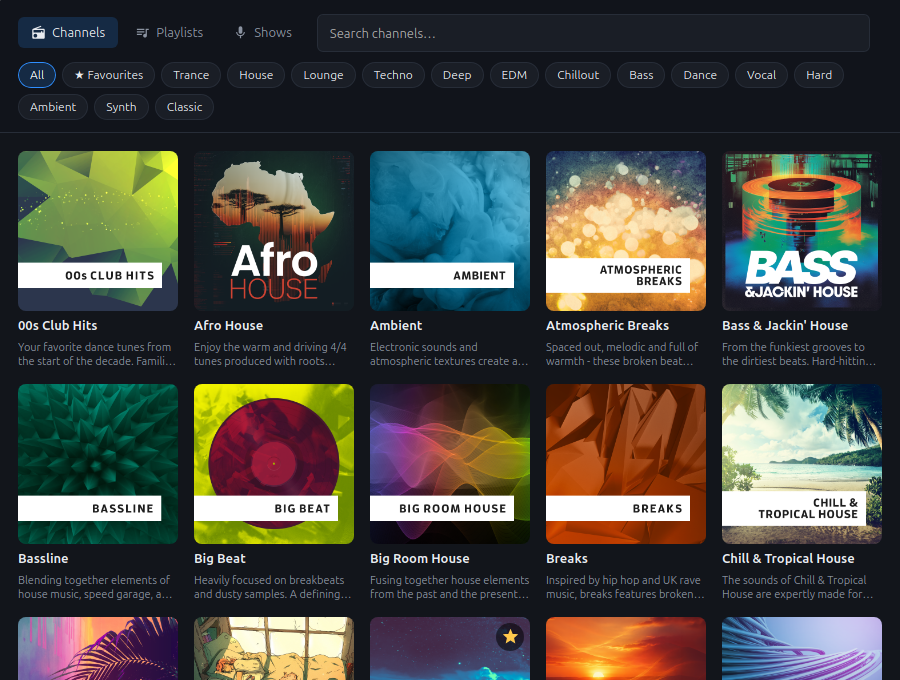

# di.fm

[](https://github.com/arkady-emelyanov/di.fm/actions/workflows/ci.yml)

DI.FM and JAZZRADIO system tray player. Premium subscription required.

Pick a station from the tray, without keeping a browser tab open. It plays the same high-quality, track-based streams as the official browser extension. Unofficial: not affiliated with DI.FM, JAZZRADIO.com or AudioAddict.

<table>
  <tr>
    <td align="center" valign="top">
      <br>
      <sub><b>Tray popup</b>: your channels, playlists and shows, playback controls and volume, one click from the tray.</sub>
    </td>
    <td align="center" valign="top">
      <br>
      <sub><b>All channels</b>: browse, search and filter by genre; star a channel to add it to the popup.</sub>
    </td>
  </tr>
</table>

## Features

- Tray popup with your followed channels, playlists and shows, a volume slider, play/pause, stop and skip.
- Media keys and headphone buttons play, pause, skip and stop; the current track and channel show up in the desktop's media controls (MPRIS on Linux, the media overlay on Windows, Now Playing on macOS).
- Switch between DI.FM and JAZZRADIO with one click; your account works on both and the app creates the second session itself.
- Browse all channels, playlists and shows, search them, filter by genre, and follow or unfollow from the list.
- Audio quality setting (64k AAC-HE, 128k AAC or 320k MP3), shared with your account.
- Tunes in where the live broadcast is, plays gaplessly, and pauses when the account starts streaming on another device (only one stream per account is allowed).
- Starts at login (Linux; can be turned off in the settings menu).

## Install

Download the build for your machine from the [latest release](https://github.com/arkady-emelyanov/di.fm/releases/latest). Each file has a `.sha256` file next to it.

| Platform | File | Notes |
|---|---|---|
| Linux x86_64 | `difm-x86_64-linux` | Needs GTK 3, WebKitGTK 4.1 and ALSA (Ubuntu 22.04+, Linux Mint 21+: `sudo apt install libwebkit2gtk-4.1-0 libasound2`). The tray icon needs a StatusNotifierItem host (Cinnamon, KDE, MATE, Xfce; GNOME with the AppIndicator extension). |
| macOS Apple silicon | `difm-aarch64-macos.zip` | Unzip and move `DI.FM.app` to Applications. The app isn't notarized, so the first launch is blocked: run `xattr -dr com.apple.quarantine /Applications/DI.FM.app` once. |
| Windows x86_64 | `difm-x86_64-windows.exe` | Needs the WebView2 runtime, which comes with Windows 10 and 11. SmartScreen may warn about an unknown publisher; choose "More info", then "Run anyway". |

On Linux:

```
curl -Lo ~/.local/bin/difm https://github.com/arkady-emelyanov/di.fm/releases/latest/download/difm-x86_64-linux
chmod +x ~/.local/bin/difm
difm &
```

On first start the app adds itself to the application menu and to the login items.

## Use

Click the tray icon to open the popup, log in with your DI.FM email and password (accounts created with Google or Apple sign-in can use "Sign in via website"), and pick a channel. Right-click the tray icon for a small menu with play/pause, stop, all channels, log out and quit. The gear in the popup holds the audio quality, start at login, log out and quit.

## Develop

On Linux, install the development packages first:

```
sudo apt install libgtk-3-dev libwebkit2gtk-4.1-dev libasound2-dev
cargo run
```

Set `RUST_LOG=difm=debug` for detailed logs. CI builds and tests Linux, macOS and Windows on every push; publishing a GitHub release builds the binaries and attaches them to it.
